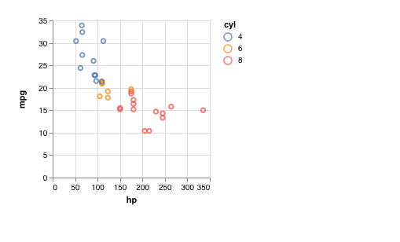
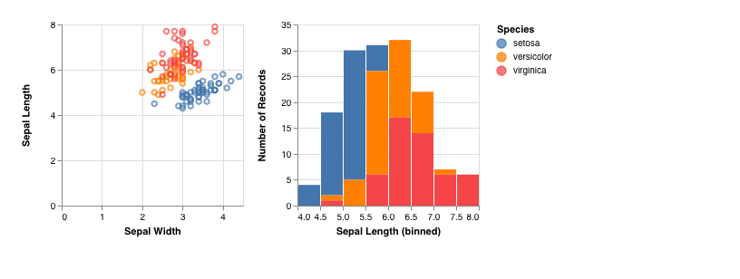

# vl

vl provides conveniences for writing vega-lite specifications from R
(work in progress). The preference here is to find a middle ground between encouraging the use of vega-lite directly and relying on an full-fledged R interface. The result is a lightweight R6 object `vl()`, which is mainly inspired from [to-vega](https://github.com/gjmcn/to-vega). This can be thought of as a way to write specifications in a shorter form. 


```r
vl::vl()$data(mtcars)$point()$x("hp")$y("mpg")$color("cyl")$plot()
```


```r
vl::vl()$
  data(iris)$
  hconcat()$
    point()$
      x("Sepal.Width")$
      y("Sepal.Length")$
      color("Species")$
    bar()$
      x("Sepal.Length", bin = TRUE)$
      y(aggregate = "count")$
      color("Species")$
  plot()
```



