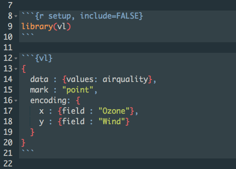

# vl

vl provides conveniences for writing vega-lite specifications from R
(work in progress). The preference here is to encourage the use of vega-lite directly in the place of an R interface. 


## Examples

A vl specification can be expressed as a JS object string (or as JSON):

```r
vl::vl('{
 data : {values: iris},
 mark : "point",
 encoding : {
   x : {field : "Sepal.Length"},
   y : {field : "Sepal.Width"},
   color : {field : "Species"}
 }
}')

```
(Note that one can refer to an existing R object inline without having to `paste` in the object)

or alternatively as an R list object:

```r
vl::vl(
  list(
    data = list(values = iris),
    mark = "point",
    encoding = list(
      x = list(field = "Sepal.Width"),
      y = list(field = "Sepal.Length"),
      row = list(field = "Species")
    )
  )
)
```


## Rmarkdown

When in Rmarkdown, vegalite specifications can be written as inline JS objects:



Thanks to RStudio for this [idea](https://github.com/rstudio/r2d3)


## Templates
For quick source editing in RStudio a number of templates are pre-specified (to do) which will print to the active document

```r
#vl::spec()
vl::vl('
{
  data: { values:  },
  mark: "",
  encoding: {
    x: {field: "" },
    y: {field: "" },
  }
}')

```

