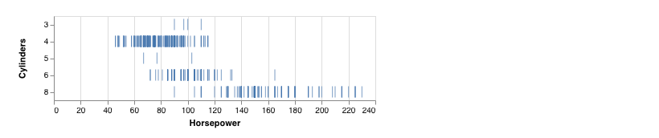
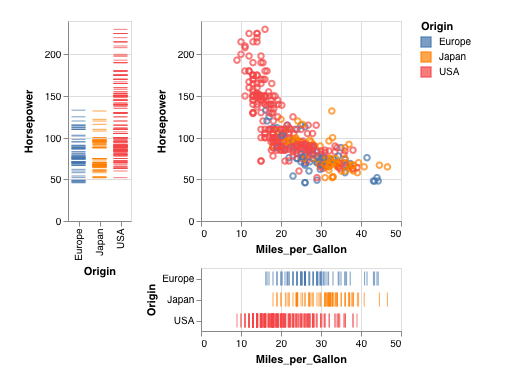

# vl 
vl provides a lightweight R6 interface for writing vega-lite specifications. Inspired mainly by [to-vega](https://github.com/gjmcn/to-vega), vl can be thought of as a way to write the JSON equivalent specification in short-form notation.

```r
vl::vl()$
  data("!cars.json")$
  tick()$
    x("Horsepower:Q")$
    y("Cylinders:O")$
  width(400)$
  plot()
```


vl tries to find the middle ground between writing specs via an interface (instead of writing out the equivalent R list object) without abstracting too far away from the underlying JSON syntax. This complements the existing R htmlwidgets package, [vegalite](https://github.com/hrbrmstr/vegalite), which provides a great `%>%`-able api.

## Install

vl is a work in progress

## Usage

Using vl works in a similar way as [to-vega](https://github.com/gjmcn/to-vega).
Initiate a new vl environment with `vl`. Data can be attached to the current view via `data` as a dataframe, local file, or url. To refer to a vega dataset url, prefix the name with `!`. 

A vl specification can be parsed with `plot`. The vl print method plots the current vl specification. `as_spec` returns the current specification as a list or JSON. 


### View specifications 

View specifications can be set with one or more of the following: `description`, `title`, `width`, `height`, `name`, `background`, `padding`, `autosize`, `config`, `selection`, `facet`, `repeat_row`, `repeat_column`,
`repeat_row_column`, `transform`

These methods accept relevant their properties/parameters as arguments and are applied to the current view. When a parameter is passed as an unnamed vector this applies to the current method, `title("hi this is a title")`, otherwise named vectors will set the properties of the current method `title(text = "hi again", anchor = "start")`.

Note that `repeat_row`, `repeat_column`, `repeat_row_column` refer to [repeat](https://vega.github.io/vega-lite/docs/repeat.html) in order to avoid clashing with `base::repeat` 


### Mark

Specify a mark as one of `area`, `bar`, `circle`, `line`, `point`, `rect`, `rule`, `square`, `text`, `tick`, `geoshape`

These methods accept any optionally specified properties relevant to that mark. For instance, `text(align = 'left', dx = 100, dy = -5)` See the official [docs](https://vega.github.io/vega-lite/docs/mark.html) for details on mark-specific properties.


### Encoding

Specify an encoding channel as one of  `x`, `y`, `x2`, `y2`, `color`, `opacity`, `size`, `shape`, `label`, `tooltip`, `href`, `order`, `detail`, `row`, `column`.

When an encoding is specified, it applies to the last mark that was specified. The encoding type can be specified [altair](https://altair-viz.github.io/user_guide/encoding.html) style, `x(field = "var:Q")`, short-form style,
`x(field = "var", type = "Q")` or in full form notation `x(field = "var", type = "quantitative")` for those who like extra typing.

Note that `label` refers to the [text](https://vega.github.io/vega-lite/docs/text.html) encoding to avoid a clash with the `text` mark. 

### View compositions

View compositions can be set with `layer`, `hconcat`, `vconcat`, `spec`.

When a view composition is specified, any succeeding vl method will be applied to this compostion. These methods take no arguments. To exit the current view composition use `exit_view`. Note that it is not necessary to call `exit_view` if only two views are present and the succeeding method is `plot` or `as_spec`. 

To add a composition to an existing composition use `add_view`. 

To take an [example](https://bl.ocks.org/g3o2/bd4362574137061c243a2994ba648fb8):

```r
v <- vl()
v$data("!cars.json")$
  hconcat()$
  tick()$
    y("Horsepower:Q")$
    x("Origin:N")$
    color("Origin:N")$
  add_view()$
  vconcat()$
  point()$
    x("Miles_per_Gallon:Q")$
    y("Horsepower:Q")$
    color("Origin:N")$
  tick()$
    x("Miles_per_Gallon:Q")$
    y("Origin:N")$
    color("Origin:N")$
  plot()
```


## Related

Beyond the projects already previously mentioned, here are some related works

[vegaliteR](https://github.com/timelyportfolio/vegaliteR)

[finch](https://github.com/netbek/finch)
